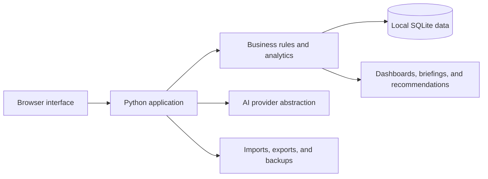

# CaliCat CRM

An AI-assisted, local-first CRM built for relationship-driven sales and business development.

> This is the public product showcase for CaliCat CRM. The application source code and operational data remain in a separate private repository.

## Why I built it

Traditional CRMs are good at storing records, but they often make the work of building relationships feel secondary. I built CaliCat CRM to help a seller answer practical questions:

- Who needs attention today?
- What changed in this relationship?
- What is the strongest next action?
- Where is an opportunity losing momentum?
- What context should I review before a meeting?

The result is a working CRM that combines structured sales data, relationship history, daily workflow tools, and explainable AI-assisted recommendations in one local application.

## Product highlights

### Relationship intelligence

- Unified relationship timelines
- Interaction and message history
- Relationship health, momentum, and risk signals
- Contact and company summaries
- Role coverage and buying-group visibility
- Explainable next-best-action recommendations

### Daily sales workflow

- Prioritized work queue
- Today, overdue, and upcoming follow-ups
- Waiting-on-reply tracking
- Quick interaction logging
- Meeting preparation and daily briefing views
- Weekly review and performance insights

### Account and opportunity management

- Company 360 workspace
- Contact, company, product, and opportunity records
- Opportunity stages and next-step tracking
- Account research and notes
- Campaign and outreach planning
- Company-level search and activity history

### Data quality and safety

- Duplicate detection
- Import preview and field mapping
- Backup before high-risk record changes
- Restore workflow with confirmation
- Append-only relationship history
- Local SQLite storage

## Architecture at a glance

CaliCat CRM is intentionally local-first and dependency-light. The application uses Python's standard library, server-rendered HTML, responsive CSS, and SQLite. Data access, workflow rules, analytics, and HTTP routing run in a single local application process.

See [ARCHITECTURE.md](ARCHITECTURE.md) for a deeper product-level summary.

## Screenshots

Sanitized product screenshots are being prepared. The showcase will include:

1. Daily relationship dashboard
2. Prioritized work queue
3. Company 360 view
4. Relationship timeline
5. Daily briefing
6. Sales insights

See [screenshots/README.md](screenshots/README.md) for the capture and privacy checklist.

## Current status

The private application is an active working project with:

- A complete local CRM foundation
- Automated coverage for core data and workflow behavior
- Contact, company, opportunity, meeting, campaign, and knowledge workflows
- AI provider abstraction with a deterministic no-AI mode
- Import, export, backup, and restore safety features
- Responsive desktop and mobile layouts

## Roadmap

Near-term product work focuses on:

- Sanitized demo data and public product screenshots
- Smaller internal modules for easier maintenance
- Browser-based end-to-end testing
- Accessibility checks
- Pagination and query batching for larger datasets
- Optional integrations while preserving local control

See [ROADMAP.md](ROADMAP.md) for more detail.

## What this project demonstrates

- Product thinking grounded in real sales workflow problems
- Translating relationship-management needs into usable software
- Incremental delivery with tests and documentation
- Practical data safety, duplicate prevention, and recovery design
- Designing AI assistance that explains recommendations instead of hiding the reasoning

## Technology

- Python
- SQLite
- HTML
- CSS
- JavaScript
- Git and GitHub
- ChatGPT and Codex as development collaborators

## Repository boundary

This repository contains product documentation and sanitized showcase assets only. It does not include application source code, databases, credentials, customer information, private configuration, or production exports.

## About the builder

Built by Michael O'Malley as a practical exploration of how AI-assisted software can make relationship-driven sales work more focused, contextual, and useful.

